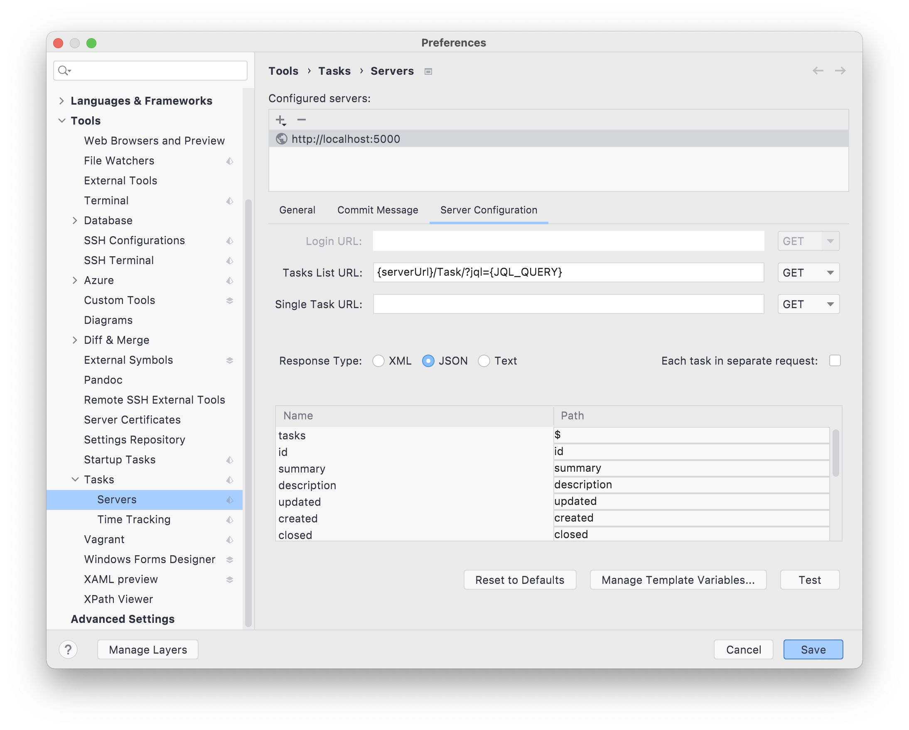

# idea_generic_task_server 

## Deploy
- docker-compose
```yaml
prd_server:
    image: lotosbin/idea_generic_task_server
    environment:
      - ASPNETCORE_ZENTAO_HOST=https://demo.zentao.pm/
    ports:
      - "5000:80"
```
[docker-compose.yml](./docker-compose.yml)

## Usage
参考 idea generic task server配置
使用http basic 认证
```
serverUrl: http://localhost:5000
taskUrl: {serverUrl}/Task/?jql={JQL_QUERY}
fields:
    tasks:$
    id:id
    updated:updated
    created:created
    summary:summary
    description:description
    closed:closed
```

- template value
```
JQL_QUERY assignee = currentUser() AND resolution = unresolved
```

