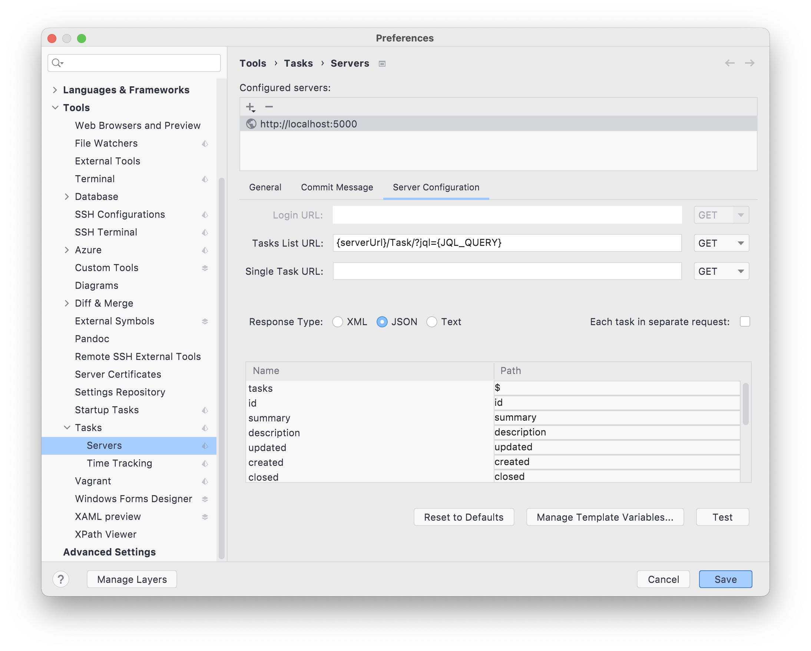

# 

## Usage
参考 idea generic task server配置
```
serverUrl: http://localhost:5000
taskUrl: {serverUrl}/Task/?jql={JQL_QUERY}
fields:
    tasks:$
    id:id
    updated:updated
    created:created
    summary:summary
    description:description
    closed:closed
```

- template value
```
JQL_QUERY assignee = currentUser() AND resolution = unresolved
```


## TODO
- [] 禅道登录接口成功，但是后续接口调用失败问题，暂时没有找到原因，临时使用http basic 认证，sessionName作为username，sessionId作为password， 